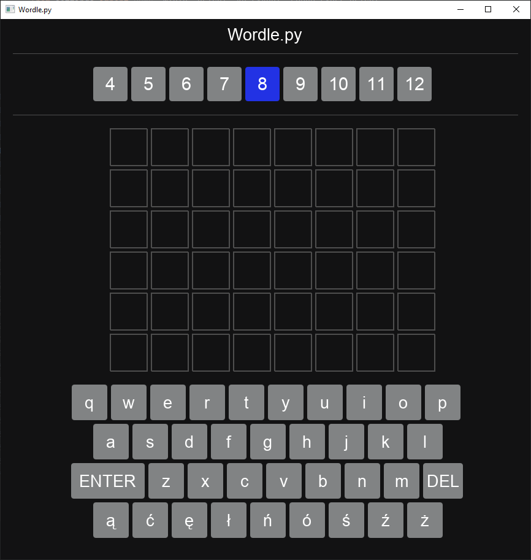
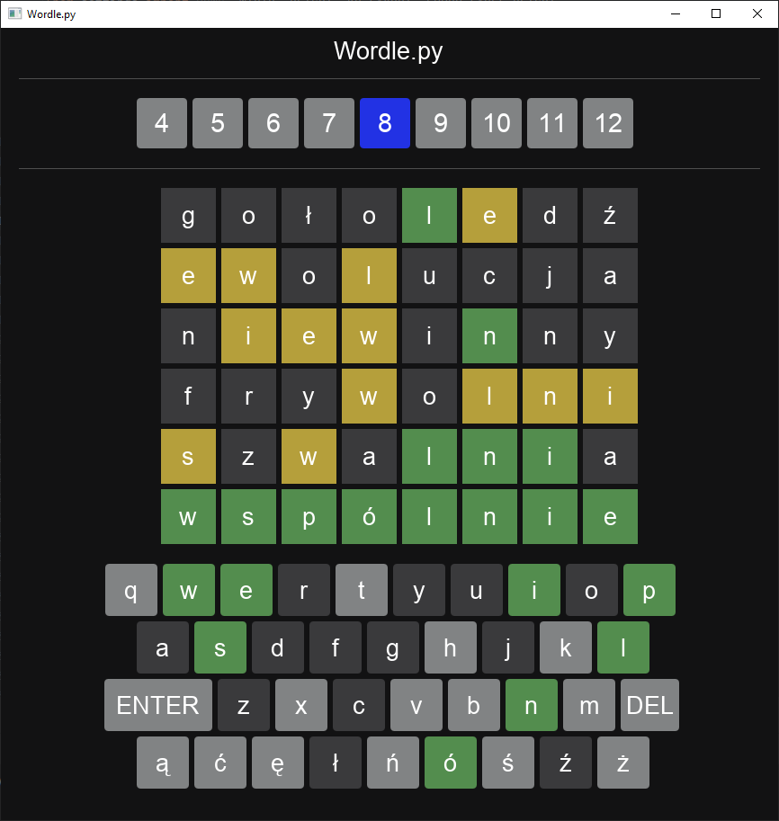

Supported language - polish only
Fork from:
https://github.com/j-zunino/Wordle.py

Wordle in polish language with choosable word length.
Wordle is a word game where player have six attempts to guess a hidden word. 
After each guess, the tiles change color to indicate how close the guess was, 
providing clues to narrow down the options. 
Color feedback rules:
- green: the letter is in the word and in the correct place.
- yellow: the letter is in the word but in the wrong place.
 -gray: the letter is not in the word at all.

SAMPLE EMPTY GAME BOARD (8-letter word challenge):

SAMPLE GAME FINISHED WITH THE CORRECT GUESS:

